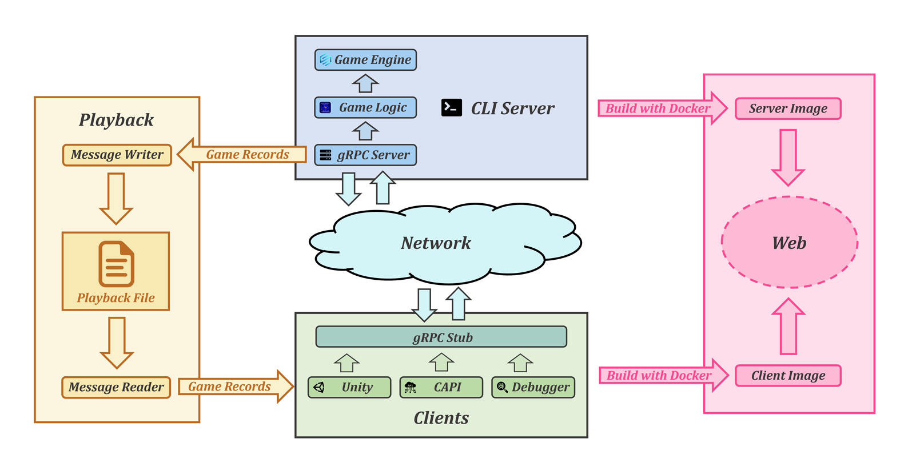

# THUAI7
清华大学第七届人工智能挑战赛电子系赛道（原电子系第 25 届队式程序设计大赛 teamstyle25）

## 赛题背景

待定

## 比赛规则

待定

## 软件架构

## 仓库说明

### 配置说明

本仓库使用 git 进行版本控制，为所有开发工作共用仓库，请勿上传不必要的文件。主目录文件结构非必要请勿修改，且主目录中已配置的 `.gitignore`、`.gitattributes` 文件非必要请勿修改；各子目录已预先包含使用 `Visual Studio` 开发的 `.gitignore` 模板，可以根据自身需要增加忽略规则；如有必要，可在子目录下自定义 `.gitattributes` 文件。

### 目录分配

|   子目录   |                            说明                            |           主要开发组           |
| :--------: | :--------------------------------------------------------: | :----------------------------: |
|  .github   |           CI，用于选手包同步到服务器上供选手下载           |             运维组             |
|    CAPI    |                  选手接口，生成可执行文件                  |             通信组             |
|    docs    |                       比赛的说明文档                       | 逻辑组、通信组、运维组、界面组 |
| dependency | 项目依赖文件，如 proto、dll、lib、dockerfile、shell 脚本等 | 逻辑组、通信组、运维组、界面组 |
| installer  |       下载器，用于选手包的下载与更新，生成可执行文件       |             运维组             |
| interface  |                         Unity 界面                         |             界面组             |
|  launcher  |        游戏启动器，用于快速启动游戏，生成可执行文件        |             运维组             |
|   logic    |              游戏逻辑、Server，生成可执行文件              |         通信组、逻辑组         |
|  playback  |                   游戏回放组件，生成类库                   |             逻辑组             |
|  resource  |       资源文件目录，用于存储主目录下 README 所用图片       |            端茶倒水            |

### 分支管理

- main：代码较稳定版本或阶段性成果，需要 2 reviewers，但由总负责人（端茶倒水）维护
- dev：各开发者开发工作的最新进展，需要 1 reviewer

## 开发规则

### 关于社区开发者

- 社区开发者开发工作请遵循 [THUAI7社区开发者贡献指南](./CONTRIBUTING.md)
- 社区开发者贡献的代码请遵循 [Contributor Covenant Code of Conduct](./CODE_OF_CONDUCT.md)  

### 开发流程

THUAI7 开发组成员与其他贡献者应当遵循以下流程：

1. 将 `eesast/THUAI7` fork 到自己的仓库中
2. 基于 `dev` 分支建立一个新的功能分支
3. 在新的分支上进行修改与开发
4. 向 `eesast/THUAI7` 的 `dev` 分支提出 pull request
5. 等待其他开发组成员 review 与 merge

### 使用 Git 与 Github 时的注意事项

- 非必要请勿上传大文件到 Github

- commit 提交信息请遵循 Semantic Commit 规范，即：`type: content `格式；**推荐使用 VS Code 提供的 Conventional Commits 插件进行格式化提交**。

  常用的 commit message type 包括：

  | Type     | Explanation                                    |
  | -------- | ---------------------------------------------- |
  | chore    | 日常代码开发；改变构建流程；增加依赖库、工具等 |
  | fix      | 修复bug                                        |
  | refactor | 改变代码结构，但没有增加新功能                 |
  | docs     | 修改文档，如 README、CONTRIBUTE 等             |
  | revert   | 版本回退                                       |
  | ...      | ...                                            |

- 鼓励开发组成员之间互相 review 并 merge 代码到 dev 分支上。merge 前建议简单检查其 pull request 是否符合上述规范  
- 一般情况下，不要向 main 分支提出 pull request，更不要 merge 到 main 分支上  
- 一般情况下，不允许 merge 无法通过 CI 的 pull request

### 开发约定

+ 统一使用空格缩进而非制表符缩进  
+ 统一使用 4 个空格进行缩进而非 2 个  
+ 统一使用 UTF-8 字符编码  

## 代码风格

本仓库严格规定了 `C++` 与 `CSharp` 代码风格，具体配置请参见 [.clang-format](.clang-format)

### 风格说明

几项重要规定如下：

- 需严格按照要求缩进

  ~~~csharp
  namespace Exp
  {
      public class Program
      {
          public static void Main()
          {            
          }
      }
  }
  ~~~

- `if`、`while`等关键字后须加空格

  ~~~csharp
  while (1)
  {
      // code
  }
  ~~~

- 大括号须换行书写

  ~~~csharp
  // Allowed
  if (...)
  {
     // ... 
  }
  
  // Forbidden !!!
  if (...) {
      // ...
  }
  ~~~

### 规范代码风格

- C++ 语言请按照配置文件 [.clang-format](.clang-format) 对代码进行规范，C# 语言请按照 dotnet format 进行代码规范；可以使用脚本 [dependency/shell/format.sh](./dependency/shell/format.sh) 规范代码风格

## 文档风格

仓库的文档使用 Markdown 语法，具体语法可以参照 [Markdown 语法文档](https://docs.github.com/zh/get-started/writing-on-github/getting-started-with-writing-and-formatting-on-github/basic-writing-and-formatting-syntax)。

中文文档的书写须严格遵循：[中文技术文档规范](https://github.com/ruanyf/document-style-guide)、[中文文案排版指北](https://mazhuang.org/wiki/chinese-copywriting-guidelines/)，以写出更美观的中文文档。例如：[中文文字与西文文字间空格](https://github.com/ruanyf/document-style-guide/blob/master/docs/text.md#%E5%AD%97%E9%97%B4%E8%B7%9D)、[全角标点符号的正确使用](https://github.com/ruanyf/document-style-guide/blob/master/docs/marks.md)，等等。

西文文档的书写须遵循：

+ 在 [中文技术文档规范](https://github.com/ruanyf/document-style-guide) 和 [中文文案排版指北](https://mazhuang.org/wiki/chinese-copywriting-guidelines/) 中规定的数字和西文的规范
+ 半角空格的标点符号的使用：
  + 半角的逗号 `,`、分号 `;`、句号 `.`、叹号 `!`、问号 `?` 等标点，在不位于行尾时，后需加空格，除非其后紧跟全角标点符号。例如：`"Hello, world"，是一句学习编程语言常用的句子`
  + 半角的括号 `()`、`[]`、`{}`、`<>` 等在左半括号前加空格、右半括号后加空格，除非其空格处紧跟全角标点符号或位于行首或行尾。例如：`Tsinghua University (THU) and Peking University (PKU)（我是全角括号）`

## 其他注意事项

+ 文件的字符编码格式须统一使用 UTF-8 编码，并用 4 空格缩进，尤其是 C/C++：Visual Studio 创建 cpp 文件时默认使用 GB2312 编码、TAB 缩进，因此每创建一个文件都需要注意手动设置字符编码（当代码文件中出现中文时）和缩进方式  

+ 使用等宽字体进行编程，例如 Source Code Pro、Consolas 等，便于对齐  

+ 注意代码的整洁性与可读性  

  + 代码风格尽量统一。书写不要过于紧凑，善于使用空格、缩进与换行来让代码看起来更整洁  

  + 命名风格尽量统一。相同类别的命名规则要相同，例如类名统一使用大驼峰命名法或其他常用的命名法，但是不要混用（非必要不使用匈牙利命名法）  

  + 命名应当通俗易懂，让阅读代码者能够通过命名理解变量、函数等的意义。除循环变量等可以使用 `i`、`j`、`k` 等单字母外，其他的命名应当明白如话，且谨慎使用缩写。尽量使用众人皆知的缩写，不要自创缩写。如果连自己都不知道的缩写或根本没有众人皆知的缩写，则应当坚持使用全称，命名可以适当加长。

    常用的缩写有：  

    > address-addr、answer-ans、application-app、arguments-args、array-arr、assemble-asm、(a)synchronize-(a)sync、attribute-attr、begin-beg、bitmap-bmp、buffer-buf、button-btn、clock-clk、command-cmd、coordinates-coord、copy-cpy、count-cnt、current-cur、database-db、decrease-dec、default/define-def、delete-del、dependency-dep、destination-dest、device-dev、dialog-dlg、dictionary-dict、display-disp、divide-div、document-doc、educate-edu、equal-eq、error-err、extend-ext、format-fmt、frequency-freq、function-func、horizon-horz、image-img、implement-impl、increment-inc、index-idx、information-info、initialize-init、instance-inst、iterator-itr、length-len、list-lst、memory-mem、message-msg、middle-mid、number-num、object-obj、package-pkg、parameter-param、password-pwd、pointer-ptr、position-pos、previous-prev、receive-recv、reference-ref、resource/result-res、return-ret、second-sec、select-sel、semaphore-sem、signal-sig、source-src、stack-stk、standard-std、statistic/state-stat、string-str、system-sys、temporary-temp/tmp、text-txt、user-usr、value-val、variable-var、version-ver、vertical-vert、window-win  
    >
    > 

- 命名允许较长，但不应过于啰嗦冗余，能完整表明意图即可。
- 代码应保证良好的可读性；**禁止**中学 OI 竞赛的各种“卡常”奇技淫巧！！！效率并非总是最重要的，良好的可读性与可维护性往往更加重要。
- 熟练运用面向对象编程的思想，设计架构时尽可能降低模块与模块的耦合性，保证代码的可维护性
  - 慎用全局变量、全局函数等
  - 尽可能将各功能模块化，便于日后复用；尽可能降低类与类的耦合，善用继承与多态
  - 适当设计单元测试，保证代码的正确运行

- 注意跨平台问题，代码需保证同时支持 Windows 与 Linux，避免直接的系统调用带来的跨平台问题 
- 注意维护开发文档，便于后来者快速了解本仓库代码结构
- 小组内合理分工，避免个人任务量过重或过轻
- 做好部会记录，及时完成工作任务，避免拖延到ddl
- 各组间多交流，相互了解各自的开发进度，加强协作，遇到困难互相帮助。
- 加油，奥里给  

## 开发组成员

- 逻辑组：潘徐成、顾朗哲、顾又嘉
- 通信组：肖钦帆、郭雯齐
- 界面组：陈宇瀚、韩志峰
- 运维组：张琨、叶芊屿
- 端茶倒水：李羿璇